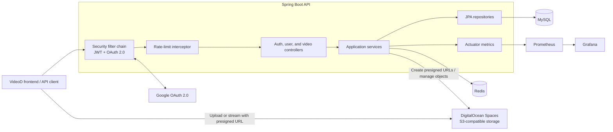
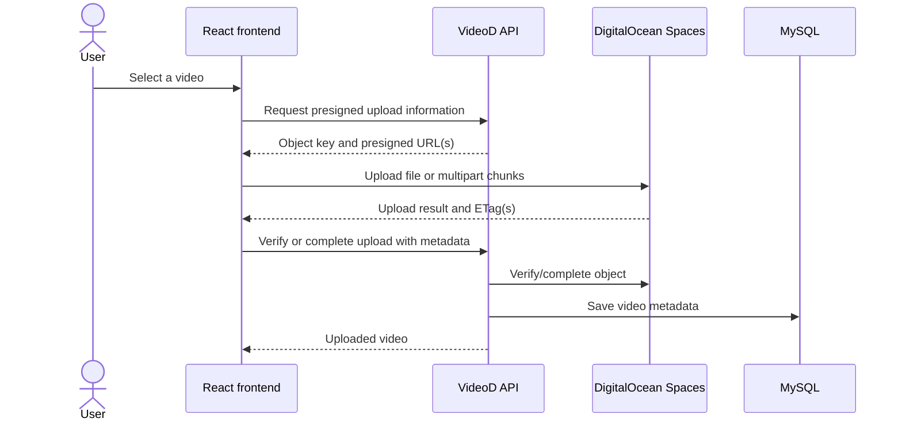
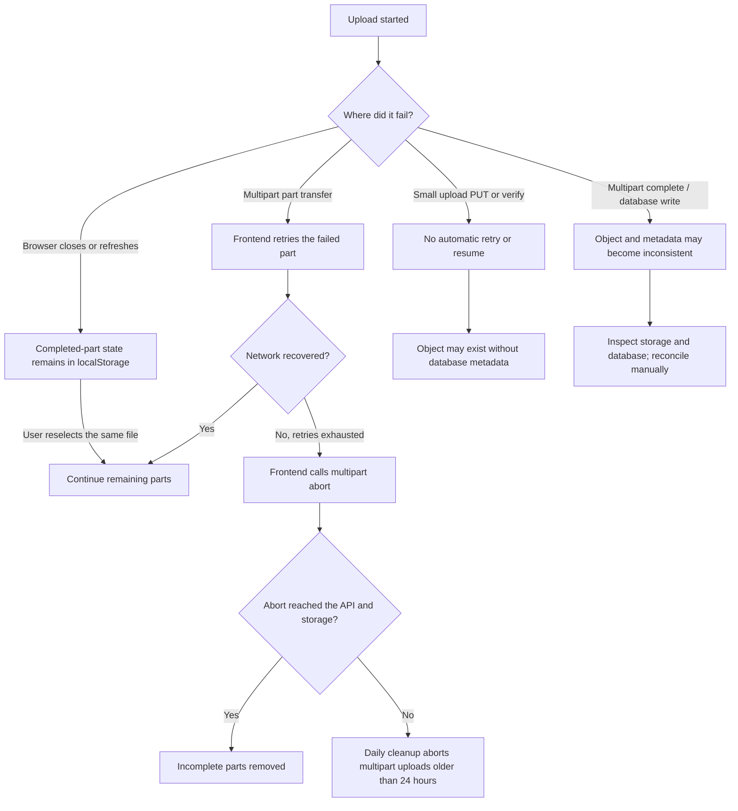

# VideoD Backend

Spring Boot REST API for the VideoD video-sharing application. The service handles authentication, video metadata, direct-to-object-storage uploads, user-owned video management, rate limiting, database migrations, and operational metrics.

## Features

- Email/password authentication with JWT access tokens
- Google OAuth 2.0 sign-in
- Role-based authorization for `USER` and `ADMIN`
- Presigned uploads to DigitalOcean Spaces (S3-compatible)
- Single-request uploads for files smaller than 100 MB
- Multipart uploads for files of 100 MB or larger
- Video browsing, cursor pagination, related videos, and filtered search
- Video update, delete, and owner-specific listing
- Plan-based rate limiting with Bucket4j and Redis
- MySQL schema migrations with Flyway
- OpenAPI/Swagger documentation and Prometheus/Grafana monitoring

## Tech stack

| Area | Technology |
| --- | --- |
| Runtime | Java 21, Spring Boot 4.0.3, Maven |
| API | Spring Web MVC, Spring Security, OAuth 2.0 Client, springdoc-openapi |
| Persistence | Spring Data JPA, MySQL, Flyway |
| Authentication | JWT (`jjwt`), BCrypt, Google OAuth 2.0 |
| Storage | DigitalOcean Spaces through AWS SDK for Java v2 |
| Rate limiting | Bucket4j, Redis, Lettuce |
| Observability | Spring Boot Actuator, Micrometer, Prometheus, Grafana |
| Testing | JUnit, Mockito, H2, Testcontainers |
| Deployment | Docker, Docker Compose, GitHub Actions |

## Architecture



## Upload flow

The API does not proxy video bytes. It authorizes an upload and returns presigned URLs so the browser can send the file directly to object storage.



## Failure and recovery flow



### Failure scenarios

| Scenario | Current behavior | Recovery / operational action |
| --- | --- | --- |
| Temporary network error during a multipart part | The frontend requests a fresh part URL and retries that part with exponential backoff. | No action if a retry succeeds. |
| Multipart retries are exhausted | The frontend marks the upload as failed, calls `/api/v1/video/abort`, and clears its saved resume state. | Fix connectivity and start the upload again. |
| User cancels a multipart upload | In-flight browser requests are cancelled and the frontend attempts `/abort`. | If the abort request cannot reach the API, the scheduled cleanup removes uploads older than one day. |
| Browser refreshes or crashes during multipart upload | Already completed part numbers and ETags can remain in `localStorage`; the multipart upload remains open in object storage. | Reselect the exact same file to resume. If the stored upload ID is no longer valid, retry once more to start a new upload after the stale state is cleared. |
| Client disconnects after a small-file `PUT` but before `/verify` | The object can exist in Spaces without a corresponding database row. Small objects are not covered by the abandoned-multipart cleanup job. | Retry verification if the object key is still available, otherwise remove the orphaned object manually. |
| Presigned URL expires | Small-upload URLs expire after 15 minutes. Multipart part URLs expire after one hour; the frontend normally obtains a new part URL on each retry. | Retry the request/upload. A stale multipart upload may need to be aborted before starting again. |
| Object storage is unavailable | Presign, verify, complete, download, or abort operations fail; upload failure metrics are incremented in verify/complete paths. | Check Spaces credentials, endpoint health, bucket permissions, and CORS, then retry. |
| MySQL is unavailable | Metadata operations fail, and startup may fail while Flyway or JPA initializes. | Restore MySQL, confirm migrations, and retry the metadata operation. |
| Redis is unavailable | Rate limiting falls back to in-memory buckets and Redis health is checked every five minutes. | Requests can continue, but limits are per application instance and reset on restart until Redis recovers. |
| Rate limit is exceeded | The API responds with HTTP `429` and `X-RateLimit-Retry-After-Seconds`. | Wait for the indicated window before retrying. Do not retry in a tight loop. |
| Prometheus or Grafana is unavailable | API traffic continues because monitoring services scrape the backend out of band. | Restore the monitoring service; metrics generated while Prometheus is down may not be retained. |

### Current consistency limitations

- Small-upload verification checks that the object exists before saving metadata, but a failed database save can still leave an object without a row.
- Multipart completion currently saves the database row before asking Spaces to complete the multipart object. If object completion then fails, a row may reference an incomplete or unavailable object.
- Video deletion currently removes the database record but does not delete the corresponding object from Spaces.
- The scheduled cleanup only handles incomplete multipart uploads older than one day; it does not remove completed-but-unreferenced objects.

These cases should be handled with an object/metadata reconciliation job or compensating transactions before treating the upload pipeline as strongly consistent.

## Prerequisites

- JDK 21
- Docker Desktop with Docker Compose, or local MySQL and Redis instances
- A DigitalOcean Space and access credentials
- A Google OAuth client if Google sign-in is required

## Configuration

Spring Boot reads the following environment variables. Never commit real credentials; the repository-level `.env` file is intended only for local Docker Compose configuration.

| Variable | Required | Default / example | Purpose |
| --- | --- | --- | --- |
| `SPRING_DATASOURCE_URL` | No | `jdbc:mysql://localhost:3306/videod` | MySQL JDBC URL |
| `SPRING_DATASOURCE_USERNAME` | No | `root` | MySQL user |
| `SPRING_DATASOURCE_PASSWORD` | No | `root` | MySQL password |
| `DO_ACCESS_KEY_ID` | Yes | - | DigitalOcean Spaces access key |
| `DO_SECRET_KEY` | Yes | - | DigitalOcean Spaces secret key |
| `GG_CLIENT_ID` | Yes | - | Google OAuth client ID |
| `GG_CLIENT_SECRET` | Yes | - | Google OAuth client secret |
| `FE_URL` | No | `http://localhost:3001` | Frontend URL used after OAuth login |
| `REDIS_URL` | No | `redis://localhost:6379` | Redis connection URL |
| `ENVIRONMENT` | No | `development` | Environment tag attached to metrics |

For the frontend in this repository set, use `FE_URL=http://localhost:3000` during local development.

PowerShell example:

```powershell
$env:DO_ACCESS_KEY_ID = "your-access-key"
$env:DO_SECRET_KEY = "your-secret-key"
$env:GG_CLIENT_ID = "your-google-client-id"
$env:GG_CLIENT_SECRET = "your-google-client-secret"
$env:FE_URL = "http://localhost:3000"
```

The Space name, region, endpoint, JWT lifetime, and application defaults are defined in [`src/main/resources/application.yaml`](src/main/resources/application.yaml).

## Run locally

Start MySQL and Redis, create a `videod` database, configure the required environment variables, and then run:

```powershell
.\mvnw.cmd spring-boot:run
```

The API is available at `http://localhost:8080`. Flyway applies the migrations under `src/main/resources/db/migration` during startup.

Useful development URLs:

| Service | URL |
| --- | --- |
| Swagger UI | `http://localhost:8080/swagger-ui/index.html` |
| OpenAPI JSON | `http://localhost:8080/v3/api-docs` |
| Health | `http://localhost:8080/actuator/health` |
| Prometheus metrics | `http://localhost:8080/actuator/prometheus` |

## Run with Docker Compose

Add the required credentials and `FE_URL` to `.env`, then start the stack:

```powershell
docker compose up -d
```

The Compose file runs the published backend image by default and provides:

| Service | Address |
| --- | --- |
| Backend | `http://localhost:8081` |
| MySQL | Internal Compose network only |
| Redis | `localhost:6379` |
| Prometheus | `http://localhost:9090` |
| Grafana | `http://localhost:3030` |

To use current local backend changes with Compose, build the tag first:

```powershell
docker build -t datnguyen10102004/videod:local .
$env:IMAGE_TAG = "local"
docker compose up -d
```

Stop the stack without deleting persisted volumes:

```powershell
docker compose down
```

## API overview

Authenticated endpoints expect `Authorization: Bearer <access-token>`.

| Method | Endpoint | Access | Purpose |
| --- | --- | --- | --- |
| `POST` | `/auth/register` | Public | Register and receive tokens |
| `POST` | `/auth/login` | Public | Sign in and receive tokens |
| `GET` | `/oauth2/authorization/google` | Public | Start Google OAuth login |
| `GET` | `/api/v1/video/all` | Public | Browse videos with cursor pagination |
| `GET` | `/api/v1/video/relate/{id}` | Public | Get related videos |
| `GET` | `/api/v1/video/search` | Public | Search by title, category, description, and date |
| `POST` | `/api/v1/video/download` | Public | Create a video download URL |
| `POST` | `/api/v1/video/upload/small` | USER, ADMIN | Create a presigned URL for a small upload |
| `POST` | `/api/v1/video/verify` | USER, ADMIN | Verify a small upload and save metadata |
| `POST` | `/api/v1/video/upload/multipart/initiate` | USER, ADMIN | Start a multipart upload |
| `POST` | `/api/v1/video/upload/multipart/part-url` | USER, ADMIN | Create a presigned URL for one part |
| `POST` | `/api/v1/video/upload/multipart/complete` | USER, ADMIN | Complete the multipart upload and save metadata |
| `POST` | `/api/v1/video/abort` | USER, ADMIN | Abort a multipart upload |
| `PUT` | `/api/v1/video/update` | USER, ADMIN | Update owned video metadata |
| `DELETE` | `/api/v1/video/delete/{videoId}` | USER, ADMIN | Delete an owned video |
| `GET` | `/api/v1/user/myvideo` | Authenticated | List the current user's videos |
| `GET` | `/api/v1/user/all` | ADMIN | List all users |

Use Swagger UI for request and response schemas. List/search responses use a cursor, a `hasMore` flag, and a video collection.

## Rate limits

The interceptor currently protects small-upload and user endpoints. Limits are selected from the authenticated user's plan:

| Plan | Bucket capacity | Refill |
| --- | ---: | --- |
| `FREE` | 5 | 1 token every 10 seconds |
| `PREMIUM` | 20 | 4 tokens every 10 seconds |
| `MAX_PREMIUM` | 1,000 | 10 tokens every 10 seconds |

Redis provides the shared limiter state; the implementation includes fallback handling when Redis is unavailable.

## Tests

Run the test suite with the Maven wrapper:

```powershell
.\mvnw.cmd test
```

Tests are under `src/test/java`. The test profile is configured in [`src/main/resources/application-test.yaml`](src/main/resources/application-test.yaml).

## Project structure

```text
src/main/java/com/dat/backend/movied/
|-- auth/        # JWT, OAuth, security configuration, login/register
|-- common/      # Shared configuration, entities, helpers, API envelope
|-- ratelimit/   # Bucket4j/Redis rate-limit services and interceptor
|-- user/        # User entity, repository, service, and API
`-- video/       # Video entity, storage integration, service, and API

src/main/resources/
|-- application.yaml
`-- db/migration/ # Flyway migrations
```

## Production notes

- Replace development database credentials and the repository's default JWT key before production use.
- Restrict CORS origins instead of allowing every origin.
- Use secure, HTTP-only cookies and HTTPS for OAuth/token flows.
- Keep DigitalOcean and Google credentials in a secret manager or deployment secrets.
